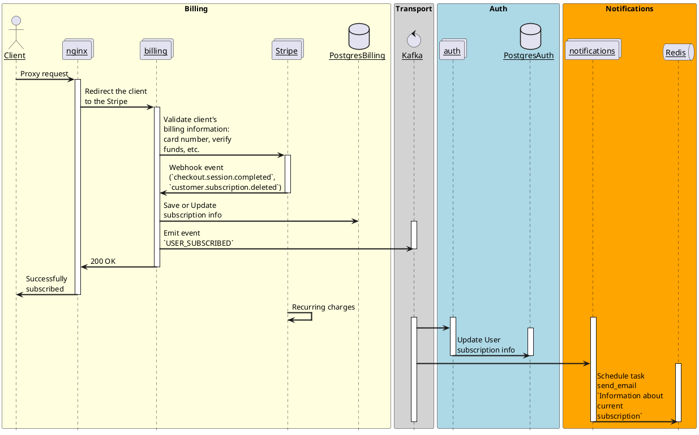

```plantuml
@startuml
skinparam componentStyle uml2
skinparam sequenceArrowThickness 2
skinparam roundcorner 5
skinparam maxmessagesize 120
skinparam sequenceParticipant underline
hide footbox
skinparam BoxPadding 2

box "Billing" #LightYellow
    actor Client
    collections nginx
    collections billing
    collections Stripe
    database PostgresBilling
end box

box "Transport" #LightGray
    control Kafka
end box

box "Auth" #LightBlue
    collections auth
    database PostgresAuth
end box

box "Notifications" #Orange
    collections notifications
    queue Redis
end box

Client -> nginx: Proxy request
activate nginx
nginx -> billing: Redirect the client to the Stripe
activate billing
billing -> Stripe: Validate client's billing information: card number, verify funds, etc.

activate Stripe
Stripe -> billing: Webhook event (`checkout.session.completed`, `customer.subscription.deleted`)
deactivate Stripe
billing -> PostgresBilling: Save or Update subscription info
deactivate PostgresBilling
activate Kafka
billing -> Kafka: Emit event `USER_SUBSCRIBED`
deactivate Kafka
billing -> nginx: 200 OK
deactivate billing
nginx -> Client: Successfully subscribed
deactivate nginx
Stripe -> Stripe: Recurring charges

activate Kafka
activate auth
activate notifications
Kafka -> auth
activate PostgresAuth
auth -> PostgresAuth: Update User subscription info
deactivate PostgresAuth
deactivate auth

Kafka -> notifications
activate Redis
notifications -> Redis: Schedule task send_email `Information about current subscription`
deactivate Redis
deactivate notifications
deactivate Kafka
@enduml
```
