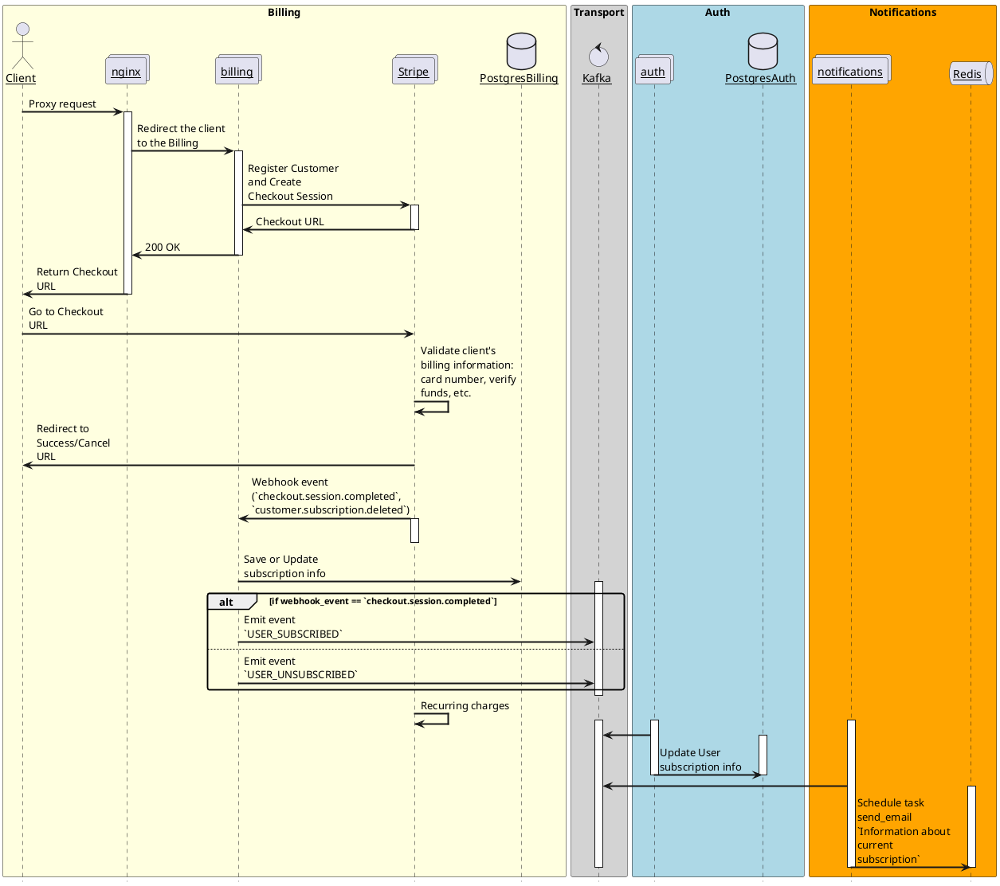

```plantuml
@startuml
skinparam componentStyle uml2
skinparam sequenceArrowThickness 2
skinparam roundcorner 5
skinparam maxmessagesize 120
skinparam sequenceParticipant underline
hide footbox
skinparam BoxPadding 2

box "Billing" #LightYellow
    actor Client
    collections nginx
    collections billing
    collections Stripe
    database PostgresBilling
end box

box "Transport" #LightGray
    control Kafka
end box

box "Auth" #LightBlue
    collections auth
    database PostgresAuth
end box

box "Notifications" #Orange
    collections notifications
    queue Redis
end box

Client -> nginx: Proxy request
activate nginx
nginx -> billing: Redirect the client to the Billing
activate billing
billing -> Stripe: Register Customer and Create Checkout Session
activate Stripe
Stripe -> billing: Checkout URL
deactivate Stripe
billing -> nginx: 200 OK
deactivate billing
nginx -> Client: Return Checkout URL
deactivate nginx

Client -> Stripe: Go to Checkout URL
Stripe -> Stripe: Validate client's billing information: card number, verify funds, etc.
Stripe -> Client: Redirect to Success/Cancel URL

Stripe -> billing: Webhook event (`checkout.session.completed`, `customer.subscription.deleted`)
activate Stripe
deactivate Stripe
billing -> PostgresBilling: Save or Update subscription info
deactivate PostgresBilling
activate Kafka
alt if webhook_event == `checkout.session.completed`
    billing -> Kafka: Emit event `USER_SUBSCRIBED`
else
    billing -> Kafka: Emit event `USER_UNSUBSCRIBED`
end
deactivate Kafka

Stripe -> Stripe: Recurring charges

activate Kafka
activate auth
activate notifications
auth -> Kafka
activate PostgresAuth
auth -> PostgresAuth: Update User subscription info
deactivate PostgresAuth
deactivate auth

notifications -> Kafka
activate Redis
notifications -> Redis: Schedule task send_email `Information about current subscription`
deactivate Redis
deactivate notifications
deactivate Kafka
@enduml
```
